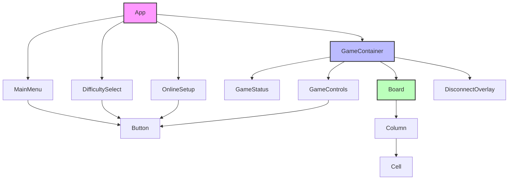
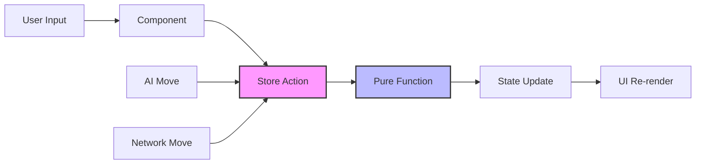
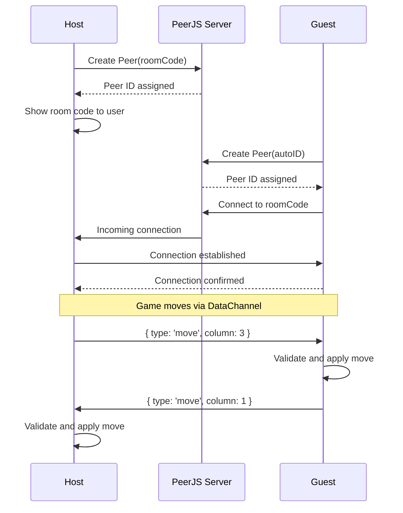
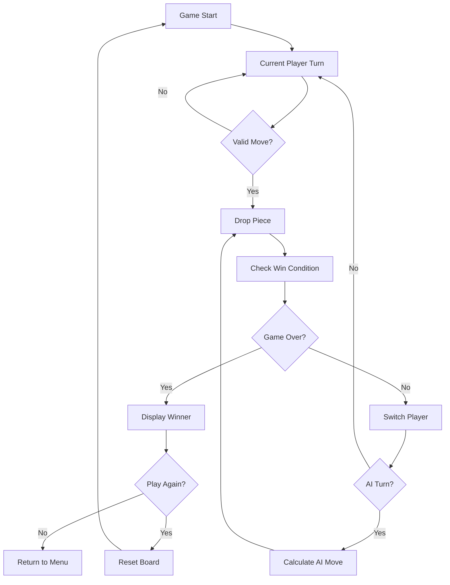

# Find Four Architecture

This document provides a comprehensive overview of the Find Four application architecture, including component hierarchy, state management, game logic, and online multiplayer implementation.

## Table of Contents

1. [Overview](#overview)
2. [Directory Structure](#directory-structure)
3. [State Management](#state-management)
4. [Game Logic](#game-logic)
5. [Online Multiplayer Flow](#online-multiplayer-flow)
6. [Component Hierarchy](#component-hierarchy)
7. [Data Flow](#data-flow)
8. [Connection Sequence](#connection-sequence)
9. [Game Loop](#game-loop)
10. [Data Types and Interfaces](#data-types-and-interfaces)

## Overview

Find Four is a React-based Connect Four game with three distinct modes: AI opponent, local multiplayer, and online multiplayer via WebRTC. The application follows a modular architecture with clear separation of concerns between UI components, business logic, and state management.

### Core Principles

- **Single Responsibility**: Each module has a focused purpose
- **Pure Functions**: Game logic is implemented as pure functions
- **State Management**: Centralized state with Zustand
- **Type Safety**: Strict TypeScript throughout
- **Component Composition**: Reusable UI components

## Directory Structure

```
src/
├── components/
│   ├── Board/
│   │   ├── Board.tsx          # 7×6 grid container, drop animations
│   │   ├── Column.tsx         # Single column, handles hover and click
│   │   └── Cell.tsx           # Individual cell display
│   ├── Game/
│   │   ├── GameContainer.tsx  # Orchestrates board and status
│   │   ├── GameStatus.tsx     # Turn indicator, winner announcement
│   │   └── GameControls.tsx   # Restart, quit, back to menu
│   ├── Menu/
│   │   ├── MainMenu.tsx       # Mode selection (AI, Local, Online)
│   │   ├── DifficultySelect.tsx   # AI difficulty picker
│   │   └── OnlineSetup.tsx    # PeerJS room code UI
│   └── UI/
│       ├── Terminal.tsx       # Terminal window chrome wrapper
│       ├── Button.tsx         # Styled terminal button
│       └── DisconnectOverlay.tsx  # Connection error modal
├── hooks/
│   ├── useKeyboard.ts         # Keyboard navigation for accessibility
│   └── usePeerConnection.ts   # PeerJS connection lifecycle
├── store/
│   ├── gameStore.ts           # Board state, turns, winner, game mode
│   └── connectionStore.ts     # Online connection state, room codes
├── logic/
│   ├── board.ts               # Pure functions: createBoard, dropPiece, checkWin
│   ├── ai.ts                  # Minimax with alpha-beta pruning
│   └── validation.ts          # Move validation helpers
├── types/
│   └── index.ts               # All TypeScript types and interfaces
├── constants.ts               # Board dimensions, AI config, theme values
├── App.tsx                    # Root component, route between menu and game
└── main.tsx                   # Entry point
```

### Architecture Layers

- **Presentation Layer**: React components in `components/`
- **Business Logic Layer**: Pure functions in `logic/`
- **State Layer**: Zustand stores in `store/`
- **Integration Layer**: Custom hooks in `hooks/`

## State Management

The application uses Zustand for state management with two primary stores:

### Game Store (`gameStore.ts`)

Manages core game state and logic:

```typescript
interface GameState {
  board: Board;              // 7×6 grid of cell values
  currentPlayer: Player;     // 1 (Hacker) or 2 (Defender)
  winner: GameResult;        // null, 1, 2, or 'draw'
  gameMode: GameMode;        // 'menu', 'ai', 'local', 'online'
  aiDifficulty: AIDifficulty; // 'easy', 'medium', 'hard'
  isThinking: boolean;       // AI computation state
}
```

**Actions**: `dropPiece`, `resetGame`, `setGameMode`, `makeAiMove`

### Connection Store (`connectionStore.ts`)

Manages online multiplayer state:

```typescript
interface ConnectionState {
  peerId: string | null;           // Local peer ID
  remotePeerId: string | null;     // Opponent peer ID
  connectionStatus: ConnectionStatus; // Connection state
  isHost: boolean;                 // Host vs guest role
  peer: Peer | null;              // PeerJS instance
  connection: DataConnection | null; // Active connection
  rematchRequested: boolean;       // Rematch state
  disconnectReason: DisconnectReason; // Why disconnected
}
```

**Actions**: `createGame`, `joinGame`, `sendMove`, `requestRematch`, `disconnect`

## Game Logic

### Core Functions (`logic/board.ts`)

- **`createBoard()`**: Initialize empty 7×6 grid
- **`dropPiece(board, column, player)`**: Drop piece with gravity
- **`checkWin(board)`**: Detect win conditions (horizontal, vertical, diagonal)
- **`getValidColumns(board)`**: Available moves
- **`isValidMove(board, column)`**: Move validation

### AI Implementation (`logic/ai.ts`)

The AI uses the minimax algorithm with alpha-beta pruning:

1. **Position Evaluation**: Analyzes board positions for strategic value
2. **Minimax Search**: Recursive game tree exploration
3. **Alpha-Beta Pruning**: Optimization for faster computation
4. **Difficulty Scaling**: Different search depths and randomness

```typescript
// Priority order in getBestMove()
1. Check for immediate AI wins
2. Block opponent's immediate wins  
3. Use minimax for strategic moves
4. Apply difficulty-based randomness
```

### Validation (`logic/validation.ts`)

- Move legality checking
- Board boundary validation
- Game state validation

## Online Multiplayer Flow

Online multiplayer uses PeerJS for WebRTC peer-to-peer connections:

### Host Flow
1. Generate random 6-character room code
2. Create PeerJS instance with room code as ID
3. Wait for incoming connections
4. Exchange moves via data channels

### Guest Flow
1. Enter host's room code
2. Create PeerJS instance with auto-generated ID
3. Connect to host using room code
4. Establish bidirectional data channel

### Move Synchronization
- Host is always Player 1 (Hacker)
- Guest is always Player 2 (Defender)
- Moves sent as JSON: `{ type: 'move', column: number }`
- Both clients validate moves independently

## Component Hierarchy



### Component Responsibilities

- **App**: Route between menu and game modes
- **GameContainer**: Orchestrate game components and state
- **Board**: Handle user input and render game grid
- **GameStatus**: Display turn info and game result
- **GameControls**: Game actions (restart, quit, rematch)

## Data Flow



### State Flow Patterns

1. **User Actions**: UI → Store → Logic → State → UI
2. **AI Moves**: Timer → Store → AI Logic → State → UI
3. **Network Moves**: Peer → Hook → Store → Logic → State → UI

## Connection Sequence



## Game Loop



### Game States

- **Playing**: Normal turn-based gameplay
- **Thinking**: AI calculating move
- **GameOver**: Winner determined or draw
- **Menu**: Mode selection
- **Connecting**: Online multiplayer setup

## Data Types and Interfaces

### Core Types

```typescript
export type Player = 1 | 2;
export type CellValue = 0 | Player;
export type Board = CellValue[][];
export type GameMode = 'menu' | 'ai' | 'local' | 'online';
export type AIDifficulty = 'easy' | 'medium' | 'hard';
export type GameResult = Player | 'draw' | null;
```

### State Interfaces

```typescript
interface GameState {
  board: Board;
  currentPlayer: Player;
  winner: GameResult;
  gameMode: GameMode;
  aiDifficulty: AIDifficulty;
  isThinking: boolean;
  selectingDifficulty: boolean;
}

interface ConnectionState {
  peerId: string | null;
  remotePeerId: string | null;
  connectionStatus: ConnectionStatus;
  isHost: boolean;
  error: string | null;
  peer: Peer | null;
  connection: DataConnection | null;
  rematchRequested: boolean;
  disconnectReason: DisconnectReason;
}
```

### Message Types

```typescript
interface PeerMessage {
  type: 'move' | 'rematch' | 'rematch-accept';
  column?: number;
}

interface Move {
  column: number;
}

interface Position {
  row: number;
  col: number;
}
```

### Constants

```typescript
export const ROWS = 6;
export const COLS = 7;
export const PLAYERS = { HACKER: 1, DEFENDER: 2 } as const;
export const AI_DEPTHS = { easy: 2, medium: 4, hard: 6 } as const;
```

This architecture provides a scalable, maintainable foundation for the Find Four game with clear separation of concerns, type safety, and efficient state management.